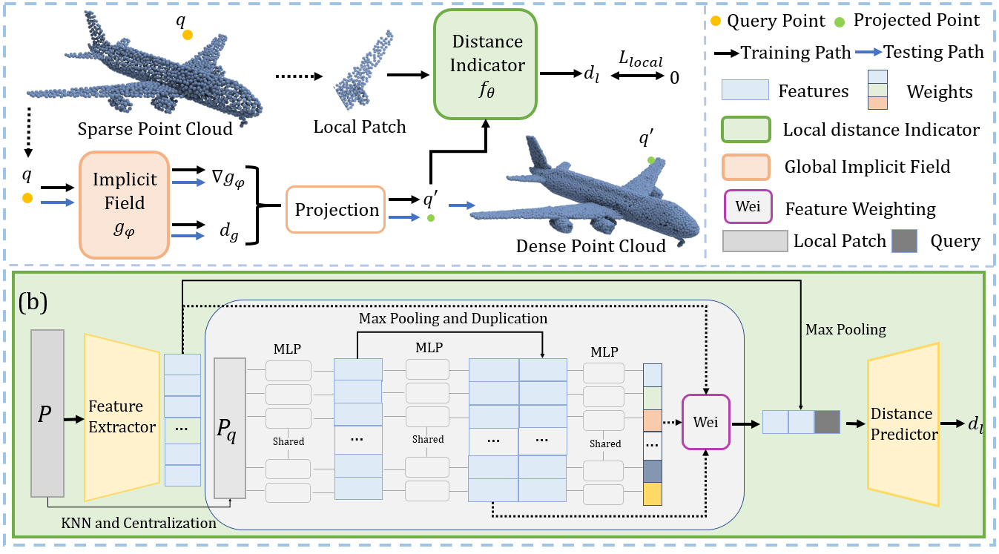

<p align="center">

  <h1 align="center">Learning Continuous Implicit Field with Local Distance Indicator for
Arbitrary-Scale Point Cloud Upsampling (AAAI 2024) </h1>
  <p align="center">
     <a><strong>Shujuan Li*</strong></a>
    ·
    <a href="https://junshengzhou.github.io/"><strong>Junsheng Zhou*</strong></a>
    ·
    <a href="https://mabaorui.github.io/"><strong>Baorui Ma</strong></a>
    ·
    <a href="https://yushen-liu.github.io/"><strong>Yu-Shen Liu</strong></a>
    ·
    <a href="https://h312h.github.io/"><strong>Zhizhong Han</strong></a>

  </p>
  
  <p align="center"><strong>(* Equal Contribution)</strong></p>
  <h3 align="center"><a href="https://arxiv.org/abs/2312.15133">Paper</a> | <a href="https://lisj575.github.io/APU-LDI/">Project Page</a></h3>
  <div align="center"></div>
</p>

<p align="center">
  
</p>

## Requirements
- Install python dependencies:
```bash
conda create -n apu-ldi python=3.7.12
conda activate apu-ldi
pip install torch==1.7.1+cu110 -f https://download.pytorch.org/whl/torch_stable.html
pip install open3d==0.17.0
pip install numpy einops scikit-learn tqdm h5py matplotlib pyhocon scipy trimesh
```
- Install the built-in libraries: 
```
cd local_distance_indicator/models/Chamfer3D
python setup.py install
cd ../pointops
python setup.py install
```
- Metric calculation (Optional)

We use the same metrics as Grad-PU. The CGAL library and virtual environment of <a href="https://github.com/guochengqian/PU-GCN">PU-GCN</a> are required. And you also need to compile folder "global_field/evaluation_code" with the following commad:
```
cd global_field/evaluation_code
bash compile.sh
```

## Data and Weights
- Data Preparation

You need to download the PU-GAN dataset (<a href="https://drive.google.com/file/d/13ZFDffOod_neuF3sOM0YiqNbIJEeSKdZ/view">trainset</a>, <a href="https://drive.google.com/file/d/1BNqjidBVWP0_MUdMTeGy1wZiR6fqyGmC/view">test mesh</a>) and <a href="https://drive.google.com/drive/folders/1k1AR_oklkupP8Ssw6gOrIve0CmXJaSH3?usp=sharing">PU1K</a> dataset, and unzip them into "local_distance_indicator/data/". The structure of data folder is similar to Grad-PU, and the detail is following:
```
data  
├───PU-GAN
│   ├───test # test mesh file
│   ├───test_pointcloud # generated test point cloud file
│   │     ├───input_2048_16X
│   │     ├───input_2048_4X
│   │     ├───input_2048_4X_noise_0.01
│   │     ...
│   └───train
│   │     └───PUGAN_poisson_256_poisson_1024.h5
└───PU1K
│   ├───test
│   │     ├───input_1024
│   │     ├───input_2048
│   │     ...
│   └───train
│   │     └───pu1k_poisson_256_poisson_1024_pc_2500_patch50_addpugan.h5 
└───KITTI
└───ScanObjectNN

```
You can download the preprocessed test point clouds <a href="https://drive.google.com/drive/folders/1SgebUP_9JupIGsRpemHer8koTTucgSQh?usp=drive_link">here</a>. Alternertively, you can follow the instructions in <a href="https://github.com/yunhe20/Grad-PU/tree/main"> Grad-PU</a> to process your own data.

- Weights

You can download <a href="https://drive.google.com/drive/folders/1SgebUP_9JupIGsRpemHer8koTTucgSQh?usp=drive_link">pretrained models</a> and <a href="https://drive.google.com/drive/folders/1SgebUP_9JupIGsRpemHer8koTTucgSQh?usp=drive_link">test results </a>.

## File Organization
The final file organization as follows. 
```
APU-LDI
├───global_field
│   ├───pretrained_global
│   │     ├───kitti
│   │     ├───pu1k
│   │      ...
├───local_distance_indicator
│   ├───pretrained_local
│   │     ├───pu1k_local
│   │     ├───pugan_local
│   ├───data
│   │     ├───PU-GAN
│   │     ├───PU1k
    ...
```


## Test
To test APU-LDI, you can use the following command:
```
cd APU-LDI/global_field
# PU-GAN
python train_global.py --conf confs/pugan.conf --mode upsample --dir pugan --dataset pugan --listname pugan.txt

# PU1K
python train_global.py --conf confs/pu1k.conf --mode upsample --dir pu1k --dataset pu1k --listname pu1k.txt

# KITTI
python train_global.py --conf confs/kitti.conf --mode upsample --dir kitti --dataname scene1

# ScanObjectNN
python train_global.py --conf confs/scanobjectnn.conf --mode upsample --dir scanobjectnn --dataname chair186
```
For arbitrary-scale upsampling, you can modify the parameters in the config file, for example:
```
# data_dir = ../local_distance_indicator/data/PU-GAN/test_pointcloud/input_2048_4X/input_2048/
# up_rate = 4
# up_name = 4X

data_dir = ../local_distance_indicator/data/PU-GAN/test_pointcloud/input_2048_16X/input_2048/
up_rate = 16
up_name = 16X
```

To generate more uniform results for real scans (such as scanobjectnn), you can generate more uniform queries using the seed points in <a href="https://github.com/xnowbzhao/PU-SSAS/">PU-SSAS</a> and put them in "local_distance_indicator/data/ScanObjectNN/pussas_seed/". You need to set "use_seed_upsample = True" in the config, please refer to the testing of ScanObjectNN.

## Evaluation
The evaluation is divided into two steps. We use the "PU-GAN 4X" setting for an example, and you need to modify the parameters for different settings. 

First, use evaluation_code to compute P2F with:
```
python write_eval_script.py --dataset pugan --upsampled_pcd_path ../pretrained_model/pugan/test/4X/
bash eval_pugan.sh
```
Then, you need to shift to the virtual environment and code folder of PU-GCN, and then run the evaluate.py script of PU-GCN repo.
```
python evaluate.py \
--pred APU_LDI/global_field/pretrained_global/pugan/4X/ \ 
--gt APU_LDI/local_distance_indicator/data/PU-GAN/test_pointcloud/input_2048_4X/gt_8192 \
--save_path APU_LDI/global_field/pretrained_global/pugan/4X/
```

## Train
To train APU-LDI on PU-GAN dataset, you can simply run the following command:
```python
# training local ldi
cd local_distance_indicator
python train_ldi.py --dataset pugan

# learning global field
cd ../global_field
python train_global.py --conf confs/pugan.conf --mode train --dir pugan --dataset pugan --listname pugan.txt
```
And you can modify the config file to set training parameters.
# Acknowledgments
Our code is built upon the following repositories: <a href="https://github.com/yunhe20/Grad-PU/tree/main">Grad-PU</a>, <a href="https://github.com/guochengqian/PU-GCN">PU-GCN</a>, <a href="https://github.com/liruihui/PU-GAN">PU-GAN</a>. Thanks for their great work.

## Citation
If you find our code or paper useful, please consider citing

    @inproceedings{li2024APU-LDI,
      title={Learning Continuous Implicit Field with Local Distance Indicator for Arbitrary-Scale Point Cloud Upsampling},
      author={Li, Shujuan and Zhou, Junsheng and Ma, Baorui and Liu, Yu-Shen and Han, Zhizhong},
      booktitle={Proceedings of the AAAI Conference on Artificial Intelligence},
      year={2024}
    }

